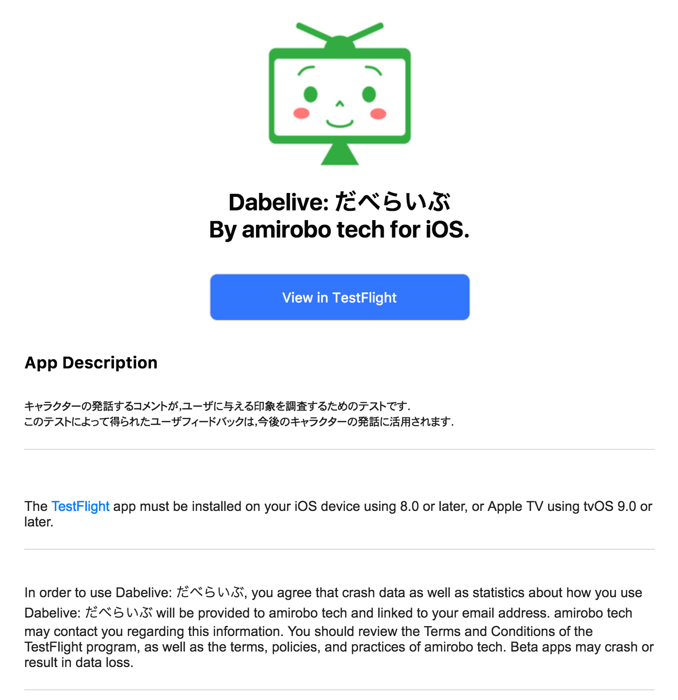
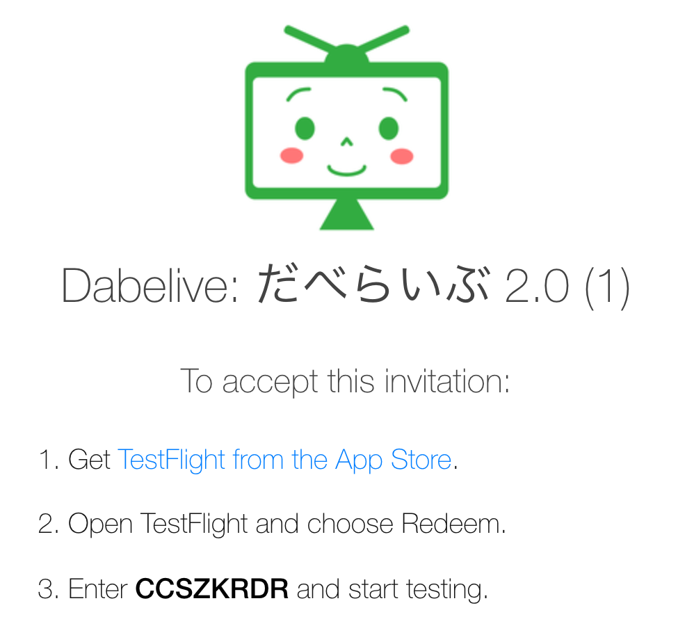
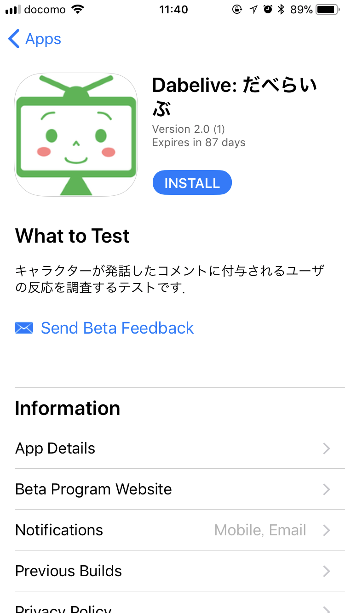
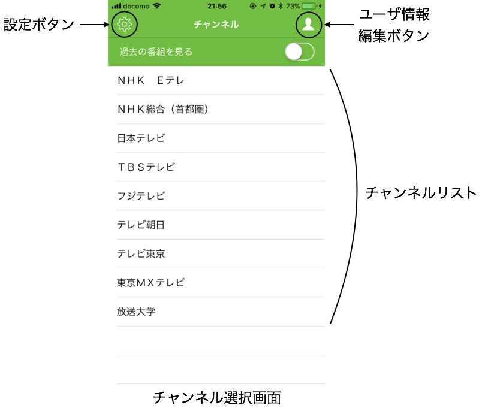
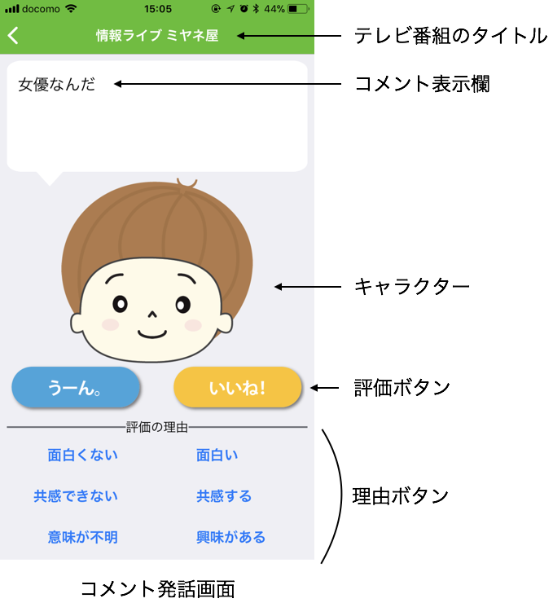
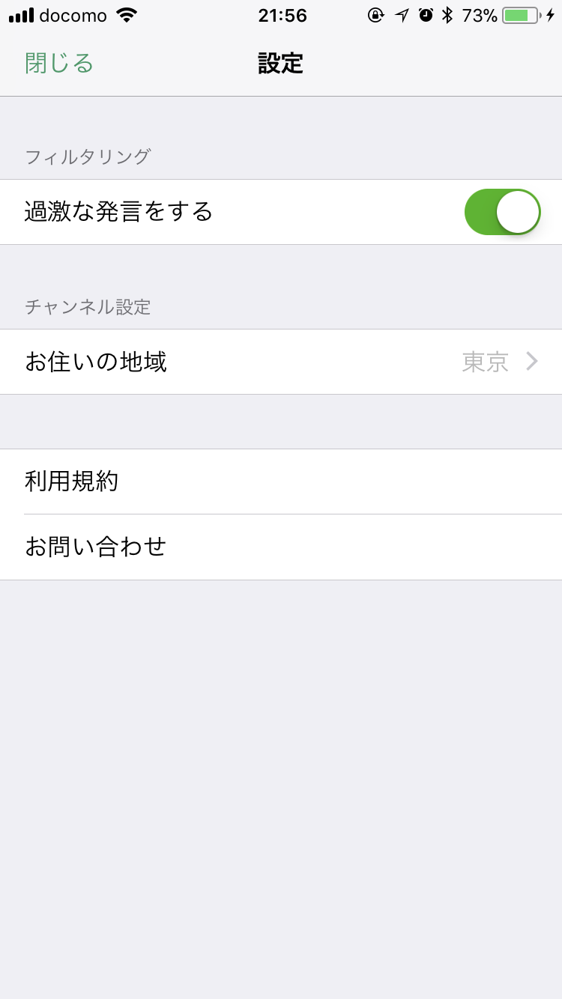
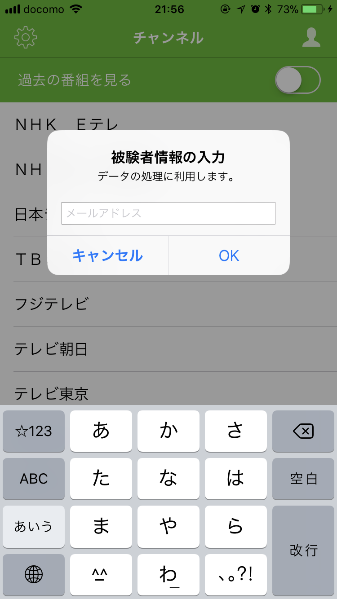

# Dabelive -だべらいぶ- アプリテストの手引
Dabelive (だべらいぶ) は，リアルタイムで放送しているテレビ番組の内容について，アプリ内のキャラクターが様々なコメントをしてくれるアプリケーションです．
http://www.amirobo.tech/services/dabelive/

我々は，ユーザが継続してDabeliveを使っていただけるように，ユーザの好みに応じた発話をする機能を開発中です．
今回ワーカーの方に取り組んでいただくタスクは，この新機能の開発に向けたユーザ評価の入力です．

## インストール手順
お手持ちのiOS端末にテスト版のアプリをインストールするためには，Appleが提供するTestflightアプリが必要です．
事前にApp Storeからインストールしておいてください．

事前にお教えいただいたメールアドレスに，Dabeliveのアプリテスト招待メールが届いているか確認してください．
招待メール内の，「View in Testflight」をクリックし，リンク先にある招待コードをTestflightアプリに入力します．
招待コードの入力後，テストアプリがインストールできます．






## Dabeliveの画面
### チャンネル選択画面
チャンネル選択画面には，お住いの地域で視聴可能な放送局の一覧が表示されています．
視聴したいテレビ番組の放送局を選択すると，後述するコメント発話画面へ遷移し，キャラクターがテレビ番組の内容に沿ったコメントを発話します．
また，設定ボタンを押すと，設定画面へ遷移します．



### コメント発話画面
コメント発話画面では，チャンネル選択画面で選択した放送局が現在放送しているテレビ番組についてのコメントを発話します．
コメントは一定の間隔で発話されます．

発話されたコメントに対して，ユーザは「いいね/うーん」の評価ボタンにて評価できます．
また，評価の理由についても理由ボタンを押すことで回答できます．



### 設定画面
設定画面では，フィルタリングとチャンネルについての設定が変更できます．

フィルタリング機能は，コメント発話画面で発話されるコメントのうち，公序良俗に反する表現を含んでいるコメントを含めるかどうか選択できます．
今回のアプリテストでは，**「過激な発言をする」をオンにしておいてください．**

チャンネル設定は，お住いの地域を設定しておくことで，その地域に対応した放送局をチャンネル選択画面に表示できます．




## アプリテストの手順
1, 2は初回時のみです．
2回目以降は3から始めてください．


### 1. メールアドレスの入力
Dabeliveを初めてインストールした場合，最初にメールアドレスの入力欄が表示されます．
このメールアドレスは，ワーカーのテスト成果の確認をする際に用いますので，必ず入力してください．
メールアドレスは，チャンネル選択画面のユーザ情報編集ボタンから編集できます．



### 2. チャンネル設定
チャンネル選択画面の設定ボタンを押して，設定画面へ移動してください．
「お住いの地域」にて，現在地の地域を選択してください．

### 3. コメントの評価
ワーカーの方の主なタスクは，Dabelive内でキャラクターが発話する各コメントに対して，評価ボタンと理由ボタンを押すことです．

指定されたテレビ番組の放送時間になりましたら，対応する放送局をチャンネル選択画面で選び，コメント発話画面を起動してください．
コメント発話画面に移動すると，自動でコメントの発話が始まります．  
コメントは一定間隔 (約7秒ごと) に切り替わりますので，それぞれのコメントに対して，まず評価ボタン (いいね/うーん) のどちらかを押します．
評価は，**そのコメントの発話によって，キャラクターともっと話したくなったか**という基準で選択してください．
- **キャラクターともっと話したい場合は「いいね」**
- **キャラクターと話したくない場合は「うーん」**

を押してください．
なお，いいね/うーん のどちらにも当てはまらない場合は，評価ボタンを押さないでください．

評価ボタンを押した場合は，続けて押した理由に最も近い理由ボタンを押してください．
#### 理由ボタンを押す例
```
笑った，気に入った -> 面白い
「せやな」「確かに」-> 共感する
「へぇ〜」「なるほど」-> 興味がある

くだらない, つまらない -> 面白くない
「なんでやねん！」，気に入らない-> 共感できない
「わけがわからない」-> 意味が不明
```

これらの作業を，テレビ番組が終了するまで行ってください．

### 4. 視聴後のアンケート
指定されたテレビ番組の視聴終了後，以下のアンケートに回答していただきます．
アンケートはテレビ番組ごとに回答してください．

アンケートのリンク: https://goo.gl/forms/F34Gfum9IF28NTrl2

